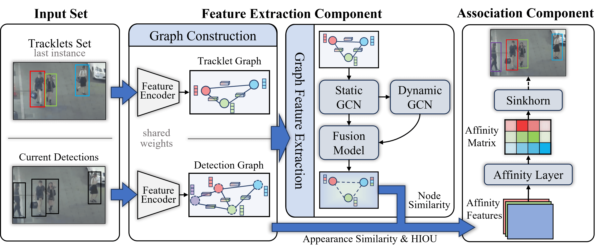

# DGCTracker: Dual-Graph Collaborative Network for Multi-Object Tracking

> **Abstract**： The core of multi-object tracking (MOT) is to solve the data association problem of discrete object detection points in video sequences to construct continuous object trajectories. Existing methods generally fail to adequately model the spatial structural relationships between objects, leading to identity switching when objects have similar appearances or are occluded, and a significant decline in association performance in high-density scenarios. To address these limitations, this paper designs a dual-graph collaborative framework for multi-object tracking, named **DGCTracker**. This framework captures spatial geometric relationships using static graphs, learns feature space dependencies through dynamic graphs, and integrates multi-scale feature fusion via hierarchical graph convolutional networks. It shows advantages in tracking accuracy and trajectory continuity. Experimental results demonstrate that the framework achieves competitive tracking performance on MOT benchmark datasets, validating its effectiveness.



## 1 Installation

- The extremely necessary packages when running our code are as follows:

```
cudatoolkit == 11.1.1

python == 3.8.18 
torch  == 1.8.1
torchvision == 0.9.1

pytorch_geometric == 2.0.1 # VERSION > 2.0.0 
torch-cluster == 1.5.9
torch-scatter == 2.0.8    
torch-sparse  == 0.6.10 
torch-spline-conv == 1.2.1  
```

* And other relevant packages are listed in `requirement.txt`.

```cmd
git clone --recursive https://github.com/Kiumb1223/DGCTracker.git
cd DGCTracker
pip install -r requirement.txt
```

- And we use pretrained ResNet50-IBN ([weights download link](https://github.com/JDAI-CV/fast-reid/releases/download/v0.1.1/market_bot_R50-ibn.pth)) module in [FAST-REID](https://github.com/JDAI-CV/fast-reid.git). After downloading the pretrained weights, plz put it in `model_weights/fastreid`.

## 2 Datasets

> In fact, we support all datasets which are correctly **organized by `MOT format`**.

- MOT16 & MOT17 & MOT20 : plz check :point_right: ​[Multiple Object Tracking Benchmark](https://motchallenge.net/)

- After finishing the downloading, plz organize data according to the following file tree structure.

```
datasets
├─ MOT16
│  ├─ train
│  │  └─ # video sequences 
│  └─ test
│     └─ # video sequences 
├─ MOT17
│  ├─ train
│  │  └─ # video sequences 
│  └─ test
│     └─ # video sequences 
└─ MOT20
   ├─ train
   │  └─ # video sequences 
   └─ test
      └─ # video sequences 
```

- Due to strict account application for MOT dataset submission, we have to split MOT benchmark datasets. Specifically, we use the last 100 frames in MOT train set as validation set and use the rest frames to train our model. And in order to convenient evaluation using **TrackEval**, it’s important to generate some configuration files.

```python  
python utils/gen_datajson.py --datasets MOT16 MOT17 --save_dataset_dir datasets/eval_datasets --save_json_dir configs
```

## 3 Training

>  Before starting training, plz check the configuration file.

<details>
    <summary>Configuration File</summary>
   
### 3.1 Some Parameter Description in `configs/config.py`
 
- `WORK_DIR`: Specify your experimental path.
- `MODEL_YAML_PATH`: Specify your model YAML path, which contains information about model structure.
- `DATA_DIR`: Specify the root directory of the dataset.
- `JSON_PATH`: Specify the JSON file path for a specific dataset

</details>


---

Taking MOT17 as an example, we set at least five parameters in `configs/config.py`.

```
WORK_DIR          = "expMOT17",
BATCH_SIZE        = 16,
MAXEPOCH          = 25,
MODEL_YAML_PATH   = 'configs/model.yaml',
JSON_PATH         = 'configs/MOT17.json',
```

Then we key the following command in terminal:

```python
# Single Device Version
python train.py

# DDP Version
OMP_NUM_THREADS=16 CUDA_VISIBLE_DEVICES=0,1 python -m torch.distributed.launch --nproc_per_node=2 train_ddp.py
```

---

IF you wanna train DGCTracker on your **PRIVATE DATASET**, what is most important is that you should organize your private dataset correctly in `MOT` format and then refer the above steps to train our model.

## 4 Evaluation

> Before starting evaluation, plz check the configuration file.

- We release our weights of MOT16 & MOT17 in [BAIDU CLOUND](https://pan.baidu.com/s/17AHaxQE45WFa0489LScj4Q?pwd=3ptt) and [GOOGLE DRIVE](https://drive.google.com/drive/folders/1nUsaBY0uhdhtOEvuMTeI9qynQtHlj-4u?usp=drive_link). Plz download them and put them in `model_weights`

Taking MOT17 as an example, we set some parameters in `configs/config.py`

```python
PATH_TO_WEIGHTS    	 = 'model_weights/MOT17.pth',
PATH_TO_TRACKING_CFG = 'configs/tracking_config-mot17.yaml',
EVAL_FOLDER        	 = 'datasets/eval_datasets'
```

Then we key the following commands in terminal:

```python
python eval.py --dataset MOT17 --tracker DGCTracker --output_dir result
# we will get annotated videoes and result txt files

python HOTA.py --dataset MOT17
# we will get detailed results of HOTA metrics & CLEARMOT metrics & Identity metrics
```

## Acknowledge

When I was coding the whole project, I referred to many brilliant code projects that inspired me a lot. Once again, sincerely many thanks to [SUSHI](https://github.com/dvl-tum/SUSHI.git), [ByteTrack](https://github.com/ifzhang/ByteTrack.git), [CPU](https://github.com/serend1p1ty/core-pytorch-utils.git), [BoxMOT](https://github.com/mikel-brostrom/boxmot.git), [THINKMATCH](https://github.com/Thinklab-SJTU/ThinkMatch.git),  etc. 


